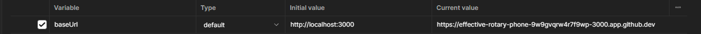

# Tarpaulin REST API

Tarpaulin is a TypeScript-based REST API designed as an alternative to platforms like Canvas. It exposes data access and manipulation endpoints for a school-oriented database, enabling functionality for students, teachers, and administrators. The API leverages MySQL with Knex as its query builder, and is deployed using AWS services — with the backend hosted on EC2 and the database managed through RDS. A local MySQL server is containerized using Docker for streamlined development and testing.

## File Structure

```
/tarpaulin-rest-api
|-- /devcontainer
|   |-- /devcontainer.json
|   |-- /docker-compose.yml

|-- /src
|   |-- /db
|   |   |--/migrations
|   |   |  |--create_users_table.ts
|   |   |  |--create_courses_table.ts
|   |   |  |--create_assignments_table.ts
|   |   |  |--create_submissions_table.ts
|   |   |  |--create_user_courses_table.ts
|   |   |--/seeds
|   |   |  |--users_seed.ts
|   |   |  |--courses_seed.ts
|   |   |  |--assignments_seed.ts
|   |   |  |--submissions_seed.ts
|   |   |  |--user_courses_seed.ts

|   |-- /controllers
|   |   |-- user.controller.ts
|   |   |-- course.controller.ts
|   |   |-- assignment.controller.ts
|   |   |-- submission.controller.ts
|   |-- /models
|   |   |-- user.models.ts
|   |   |-- course.models.ts
|   |   |-- assignment.models.ts
|   |   |-- submission.models.ts
|   |-- /routes
|   |   |-- user.routes.ts
|   |   |-- course.routes.ts
|   |   |-- assignment.routes.ts
|   |   |-- submission.routes.ts

|   |-- /middlewares
|   |   |-- auth.middleware.ts

|-- /types/express
|   |-- index.d.ts

|-- /postman_tests
|   |-- / environment
|   |-- / collection


|-- knexfile.ts
|-- server.ts

|-- .env
|-- openapi.yaml
|-- tsconfig.json
|-- package.json
|-- package-lock.json
|-- README.md
```

## Technologies Used

-   **Docker**: Containerization platform.
-   **Node.js**: Runtime environment for executing server-side code.
-   **Express.js**: Web application framework for Node.js, used for building REST APIs.
-   **Dotenv**: Used for loading environment variables from a .env file.
-   **MySQL2**: Database for storing application data.
-   **Morgan**: HTTP request logger middleware.
-   **JWT (JSON Web Tokens)**: Used for authentication and authorization.
-   **Bcryptjs**: Used for hashing passwords.
-   **CORS (Cross-Origin Resource Sharing)**: Middleware used to enable cross-origin requests between the frontend and backend.
-   **Knex.js**: SQL query builder for Node.js, used to interact with the MySQL database and perform migrations and seed operations.
-   **AWS EC2 (Elastic Compute Cloud)**: Cloud computing service used to host and deploy the application on a remote server.
-   **AWS RDS (Relational Database Service)**: Managed database service provided by AWS, used to host the MySQL database for the application.

## Features

-   **CRUD Operations**: Create, read, update, and delete users, courses, assignments, and submissions.
-   **Authentication and Authorization**: Secure endpoints with JWT-based authentication.

## AWS Setup for RDS and EC2

### RDS (Relational Database Service)

-   **Database Setup**: Amazon RDS was used to host the MySQL database for the application. A MySQL instance was provisioned in RDS to store and manage the application's data.

-   **Security**: The RDS instance was configured with security groups to allow only authorized traffic from the EC2 instance and my local IP, ensuring that sensitive data is securely handled.

### EC2 (Elastic Compute Cloud)

-   **Instance Creation**: An EC2 instance was created to serve as the primary server for the application. The instance is running a Linux-based operating system (Amazon Linux 2023) and is configured to handle incoming requests for the application.

-   **Security Groups**: Proper security groups were configured to allow inbound traffic to the EC2 instance on specific different ports for ssh, MySQL, and web applications.

-   **SSH Access**: SSH keys were set up for secure access to the EC2 instance. The EC2 instance can be accessed from local development environments for tasks such as deployment and maintenance.

-   **PM2 Process Manager**: PM2 was installed to manage the application and keep it running in the background on the EC2 instance. PM2 helps ensure that the application restarts automatically in case of failure or reboot:
    -   **Starting the Application**: PM2 is used to start the application with the command: `pm2 start dist/server.js`.
    -   **Startup Script**: To ensure the application starts automatically when the instance reboots, PM2's `startup` command was used to configure the startup script: `pm2 startup`.
    -   **Saving the PM2 Configuration**: After starting the application with PM2, the configuration was saved using the command: `pm2 save`, ensuring that the PM2 process list is preserved across system reboots.
    -   **Viewing PM2 Process**: The status of running processes can be viewed using the `pm2 list` command, which shows information about the processes managed by PM2, including their status and resource usage.

By using PM2, the application is automatically managed and kept alive, reducing the need for manual intervention and improving system uptime.

## API Access

Tarpaulin API can be accessed at the address:
http://ec2-18-119-163-204.us-east-2.compute.amazonaws.com:3000

Example End Point: http://ec2-18-119-163-204.us-east-2.compute.amazonaws.com:3000/courses

Test End Points are provided in the postman collection. _See Testing section._

## Alternative API Setup on Github Codespace

1. **Create a GitHub Codespace**
   Node packages should be automatically installed and Docker container with MySQL database should be automatically created. _See .devcontainer folder._
2. **Knex Migration & Seeds**

Create tables

```bash
NODE_OPTIONS='--loader ts-node/esm' npx knex migrate:latest
```

Upload data to tables in specific order

```bash
NODE_OPTIONS='--loader ts-node/esm' npx knex seed:run --specific=users_seed.ts
NODE_OPTIONS='--loader ts-node/esm' npx knex seed:run --specific=courses_seed.ts
NODE_OPTIONS='--loader ts-node/esm' npx knex seed:run --specific=assignments_seed.ts
NODE_OPTIONS='--loader ts-node/esm' npx knex seed:run --specific=submissions_seed.ts
NODE_OPTIONS='--loader ts-node/esm' npx knex seed:run --specific=user_courses_seed.ts
```

3. **Compile Project**

```bath
npx tsc
```

4. **Start the Server**

```bash
npm start
```

## Testing

1. Set port 3000 visibility to public **only if using github codespace**.
2. Import [environment](tests/tarpaulin-api.postman_environment) and [collection](tests/tarpaulin-api.postman_collection) files to postman.
3. Set test environment to "Tarpaulin API Environment".
   

4. Set baseurl in postman environment to codespace port 3000 URL. Actual URL may be different.
   

5. Send Student, Instructor, and Admin login requests (**Tarpaulin API Tests/users/login**). Authentication Tokens should be set automatically.
6. Explore endpoints!

## Database

### View MySQL Database

Codespace may need a MySQL client to be installed.

```bash
sudo apt-get update
sudo apt-get install -y mariadb-client

```

Log into MySQL server created with docker.

```bash
mysql -h mysql -u devuser -p
devpass
```

### Tables

**Users**:

-   Attributes: **id, name, email, password, and role.**
-   Roles represents a different set of permissions to perform actions: **admin, instructor, and student**.

**Courses**:

-   Attributes: **id, subject, number, title, term, instructorID.**

**Assignments**:

-   Attributes: **id, courseID, title, points, due**.

**Submissions**:

-   Attributes: **id, assignmentID, studentId, timestamp, grade**.

**User_Courses**:

-   Attributes: **id, studentID, courseID.**

### Associations

**Users**

-   Each **User** can be associated with multiple **Courses**.
-   Each **User** can be associated with multiple **Submissions**.

**Instructors**

-   Each **Instructor** can teach multiple **Courses**.
-   An **Instructor** is a specialized type of **User** (if using role-based access or a shared user table).

**Courses**

-   Each **Course** belongs to a single **Instructor**.
-   A **Course** can have many **Assignments** posted.
-   A **Course** can have many **Users** (students) enrolled.
-   Many-to-many relationship with **Users** via the **User_Courses** table.

**User_Courses (Join Table)**

-   Manages the many-to-many relationship between **Users** and **Courses**.
-   Each row links one **User** to one **Course**.

**Assignments**

-   Multiple **Assignments** can be associated with one **Course**.
-   Each **Assignment** can be associated with many **Submissions**.

**Submissions**

-   A **Student** can make many **Submissions** for one or more **Assignments**.
-   Multiple **Submissions** can be associated with one **Assignment**.
-   Multiple **Submissions** can be associated with one **User** (student).

## Endpoints

### USERS

-   **POST /users/register/student**: Create a new student.
-   **POST /users/register/instructor**: Create a new instructor.
-   **POST /users/login**: User login.
-   **GET /users/:id**: Retrieve information about a user.

### Courses

-   **GET /courses**: Retrieve all courses.
-   **POST /courses**: Create a new course.

-   **GET /courses/:id**: Retrieve information about a course.
-   **PATCH /courses/:id** Update a course.
-   **DELETE /courses/:id** Delete a course.

-   **GET /courses/:id/students**: Retrieve all enrolled students in a course.
-   **POST /courses/:id/students**: Add or remove students in a course.

-   **GET /courses/:id/roster**: Retrieve a CSV-formatted roster of students in a course.
-   **GET /courses/:id/assignments**: Retrieve all assignments for a course.

### Assignments

-   **POST /assignments**: Create a new assignment.
-   **GET /assignments/:id** : Retrieve an assignment.
-   **PATCH /assignments/:id**: Update an existing assignment.
-   **DELETE /assignments/:id**: Delete an assignment.

-   **GET /assignments/:assignmentID/submissions**: Retrieve all submissions of an assignment.
-   **POST /assignments/:assignmentID/submissions**: Create a new submission for an assignment.

### Submissions

-   **GET /submissions/:id** : Retrieve a submission.
-   **PATCH /submissions/:id** : Update a submission.
